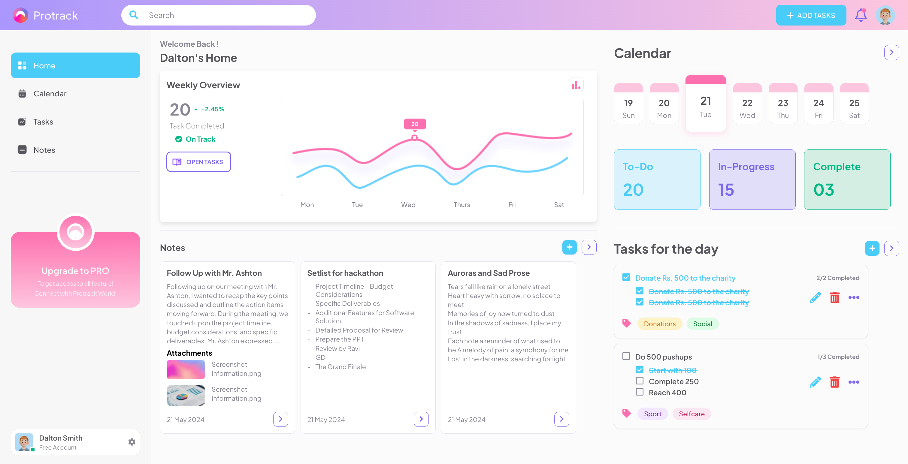

# My Website

This is a desktop-only website developed with **pure HTML and CSS**. No UI libraries, frameworks, or JavaScript were used in this project, making the codebase straightforward and focused on desktop design.



## Features

- **Pure HTML & CSS**: The website is built from scratch without any external UI libraries or frameworks, resulting in clean, understandable code.
- **Desktop-Focused Design**: The layout is optimized exclusively for desktop viewing, providing a consistent and polished look on larger screens.

## Project Structure

├── index.html # Main HTML file
├── styles.css # Main CSS file
└── assets/ # Folder for images, fonts, etc.

## How to Run

1. Clone this repository:
   ```bash
   git clone https://github.com/Haridharan20/UI.git
   ```
2. Open `index.html` in a web browser to view the website.

## Acknowledgments

This project demonstrates the power of **pure HTML and CSS** and shows that a fully functional desktop-only design can be achieved without any additional frameworks or libraries.

---

Feel free to explore and reach out if you have any questions or feedback!
